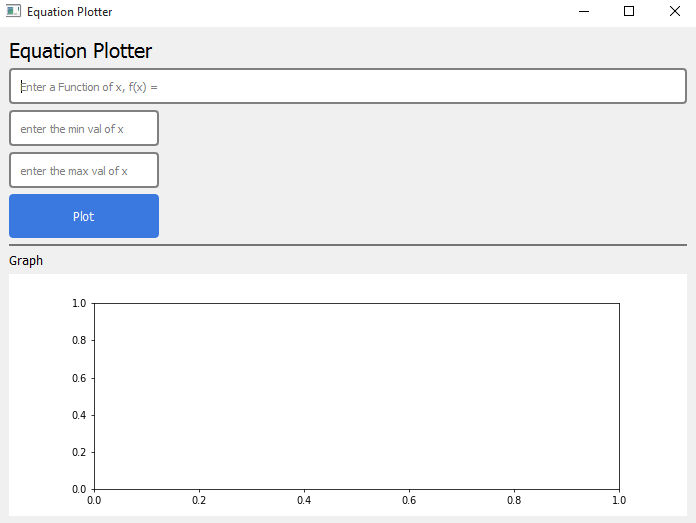
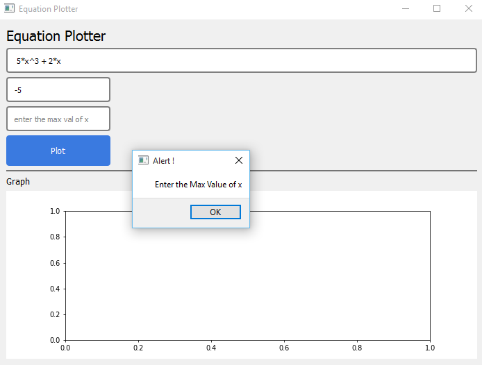
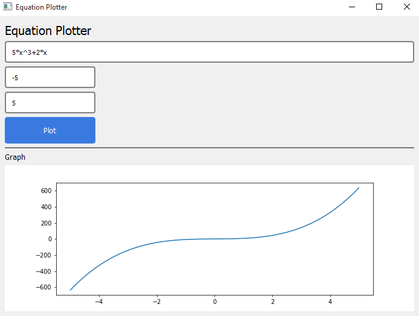
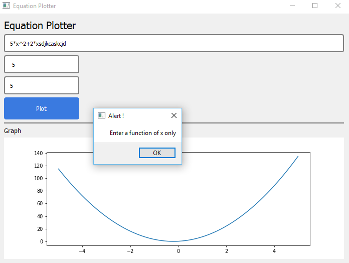
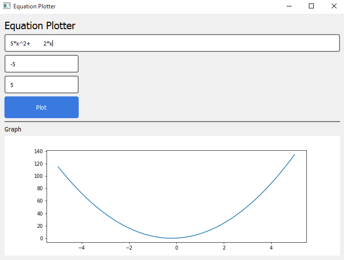

# FunctionPlotter

### A Python GUI app that takes a function of x from the user, e.g., 5*x^3 + 2*x , the minimum and maxmum values of x, then plot it on a grapg

## Preview

  Main Screen
   
  
   
  Empty Input validation
   
  
   
  Plotting Data
   
  
   
  
   
  Validate Equation Format
   
  
   
  Validate white space input
   
  

